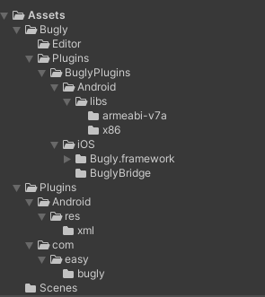
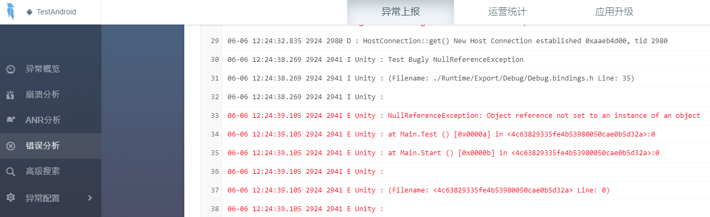
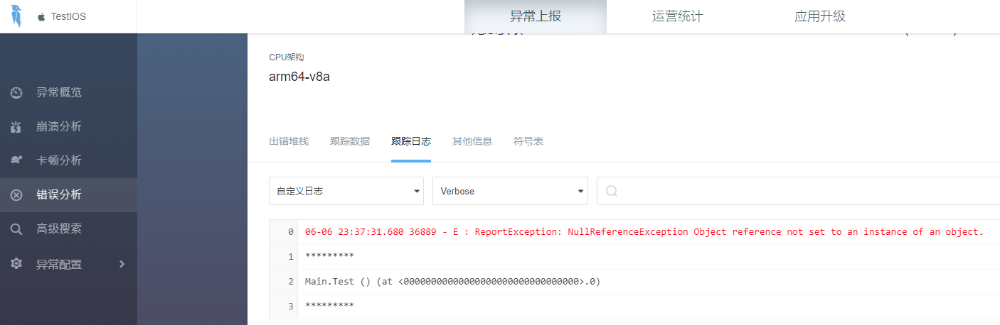

# BuglyEasyToUnity
基于腾讯Bugly Unity Plugin基础上进行了更新优化，方便Unity开发者快速接入更新更稳定的Bugly版本。

最新版本：
* Android NDK: 3.7.1
* Android SDK: 3.2.2
* iOS SDK: 2.5.5

平台:
* Android 测试通过
* iOS 测试通过

## 目录结构 ##

### Assets/Bugly/Plugins： ###
整合了Bugly Unity Plugin提供的BuglyAgent，Android和Ios库文件。
### Assets/Bugly/Editor： ###
剔除了XUPorter模块，XCodePostProcessBuild.cs基于UnityEditor.iOS.Xcode自动生成了Xcode项目需要的依赖库，后续接入的SDK Xcode设置逻辑可统一管理。
### Plugins： ###
安卓接入相关的AndroidManifest.xml 和 GamePlayerActivity.java，在安卓接入中会详细讲解。

## 如何接入 ##
`把Assets/Bugly 和 Assets/Plugins 文件拷贝到Unity工程。`

### 安卓接入： ###
#### Plugins/com/easy/bugly/GamePlayerActivity.java: ####
```
CrashReport.initCrashReport(getApplicationContext(),"android app id", false);
```
`"android app id" 替换为你的Bugly安卓app id`

#### Plugins/AndroidManifest.xml： ####


* bugly配置权限是必不可缺的设置，这个不可更改。
* networkSecurityConfig是适配Android 9.0(限制了明文流量的网络请求，非加密的流量请求都会被系统禁止掉)，这个不可更改。
* `com.easy.bugly.GamePlayerActivity 可自定义。`

#### c#调用： ####
```
BuglyAgent.ConfigDebugMode(false);
BuglyAgent.EnableExceptionHandler();
```

### IOS接入 ###
#### Assets/Bugly/Editor/XCodePostProcessBuild.cs ####
```

    static void SetBugly(string frameworkTarget,PBXProject pbxProject, string pathToBuiltProject)
    {
        var buglyPath = "Bugly";
        AddDirectory(pbxProject, pathToBuiltProject, $"{buglyPath}/Plugins/BuglyPlugins/iOS", "Bugly", null);
        ...
        ...
        ...
    }
```
`buglyPath 对应的是 “Assets/Bugly”目录，如果有移动Bugly目录，记得对应上。`

#### c#调用： ####
```
BuglyAgent.ConfigDebugMode(false);
#if   UNITY_IOS
        BuglyAgent.InitWithAppId ("ios app id");
#endif
BuglyAgent.EnableExceptionHandler();
```

`ios app id替换为你的IOS app id`


## 更新Bugly SDK ##

### 目前使用的版本 ###

* Android NDK: 3.7.1
* Android SDK: 3.2.2
* iOS SDK: 2.5.5

### 更新 Android SDK ###

#### 更新 NDK ####

到官网下载 `Android NDK` 包并解压，将 `libs` 目录中的内容删除覆盖到 `Bugly\Plugins\BuglyPlugins\Android\libs` 中

#### 更新 SDK ####

到官网下载 `Android SDK` 包并解压，将 `bugly_crash_release.jar` 删除覆盖到 `Bugly\Plugins\BuglyPlugins\Android\libs` 中

### 更新 iOS SDK ###

到官网下载 `iOS SDK` 包并解压，将 `Bugly.framework` 文件夹覆盖到 `Assets\Bugly\Plugins\BuglyPlugins\iOS` 中

## 真机测试 ##
Scenes/SampleScene是测试场景，测试脚本Scenes/Main.cs
```
using UnityEngine;
public class Main : MonoBehaviour
{
    void Start()
    {

#if   UNITY_IOS
        BuglyAgent.InitWithAppId ("your ios app id");
#elif UNITY_ANDROID
		//GamePlayerActivity已初始化，此处不需要再调用。
#endif

        BuglyAgent.ConfigDebugMode(false);
        BuglyAgent.EnableExceptionHandler();

        Test();
    }

    void Test()
    {
        print("Test Bugly NullReferenceException");
        GameObject go = null;
        go.name = "";
    }
}

```
### 安卓测试结果： ###


### IOS测试结果： ###


## 结束语 ##
个人从接入到完成真机测试，代码优化花费了2个工作日。接入过程中安卓下遇到了Android 9.0要给Bugly添加networkSecurityConfig，Xcode编译过程中如果只是使用XUPorter添加依赖库，会报链接错误，找不到Bugly库，必须要指定FRAMEWORK_SEARCH_PATHS。Bugly Unity Plugin 最新更新时间停留在了2017-06-22 1.5.3版本，官方是放弃维护更新Unity插件，只更新原生库版本。这意味着只要是跟Bugly打交道的开发者必然会重复查找修复这些已知的bug，必然会手动去更新最新的原生库，必然会浪费n个2个工作日。或许开源一个稳定可用的工具库可以解决这类重复低效无意义的事情，如果这个工具库可以帮助你节约时间快速接入，可以请我喝杯咖啡提下神去做更多这类有意义的事情。欢迎反馈bug，一起让这个工具库变得更稳定实用。

# Donate #

